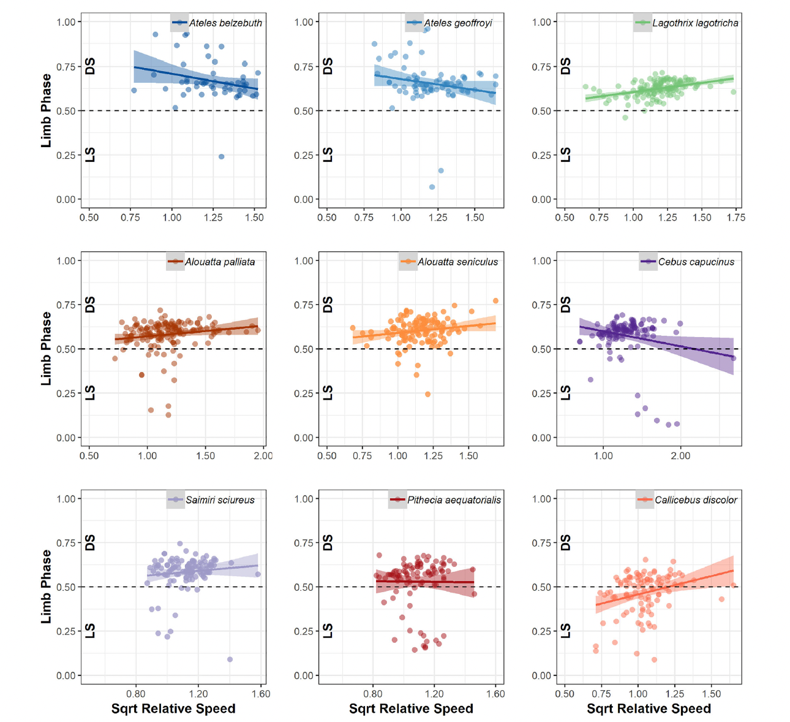
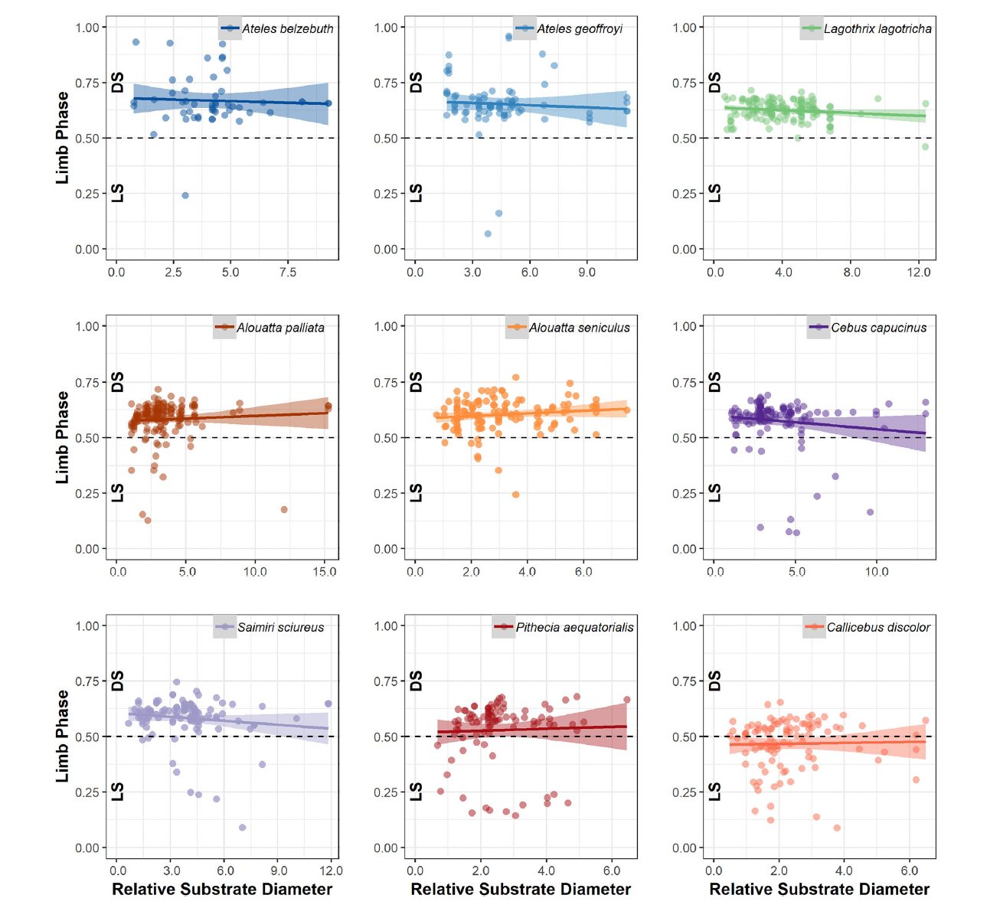
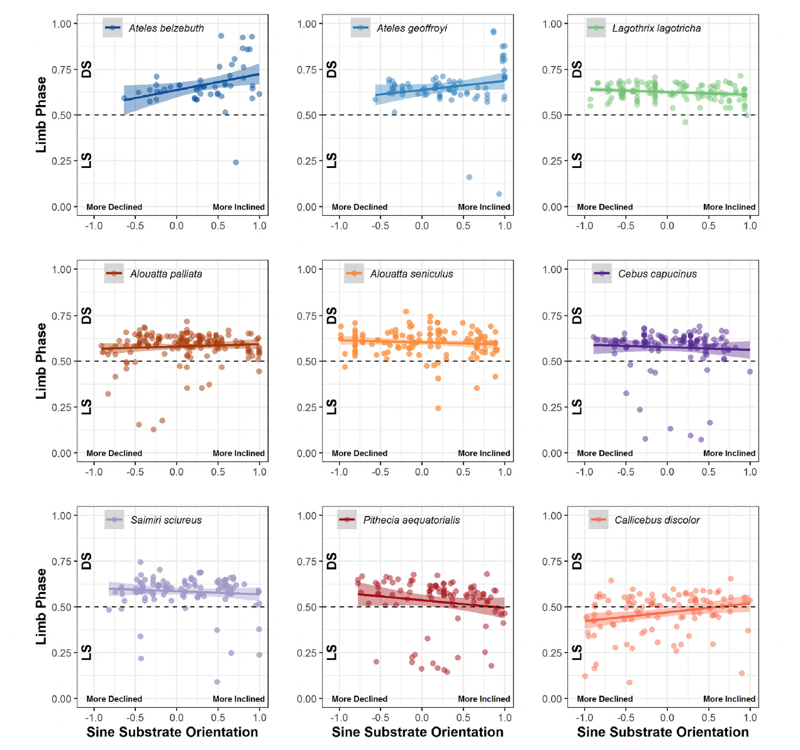
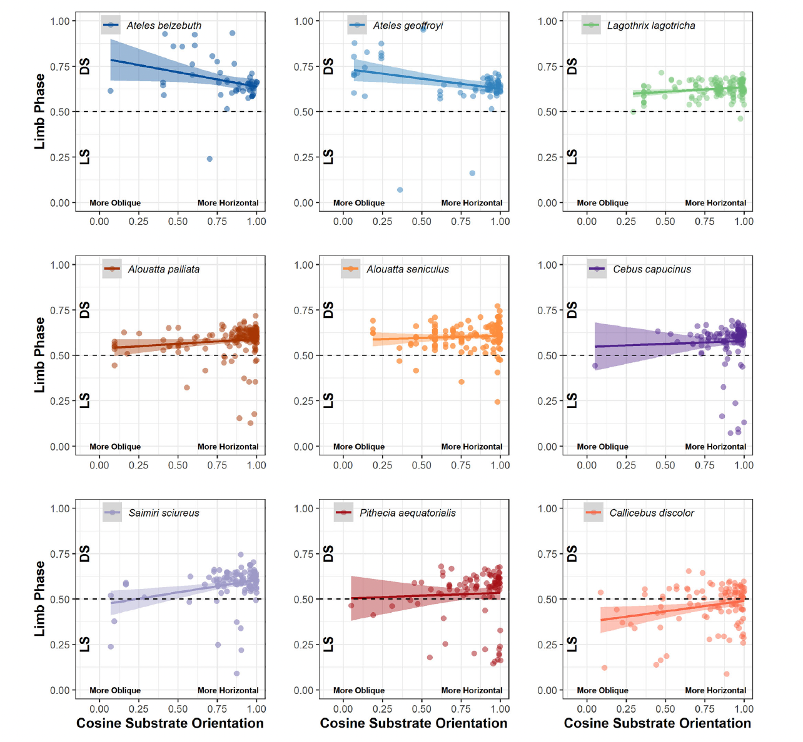

```{r setup, include=FALSE}
knitr::opts_chunk$set(echo = TRUE)
```

## Introduction

### Premise
I will be replicating the analyses in Dunham et al 2019, titled 'Effects of substrate and phylogeny on quadrupedal gait in free-ranging platyrrhines'. The objective of this study was to evaluate how substrate orientation, diameter, and relative speed as well as phylogeny affect limb phase (the percentage of the stride cycle between the touchdown of a hindlimb and its ipsilateral forelimb) and gait sequence type. For the purposes of this study, gait type was divided into two categories, diagonal sequence and lateral sequence (DS and LS). The authors predicted that primates would increase use of DS gaits on more narrow and inclined (less stable) substrates.

### Methods
Towards these objectives, data were collected in video form of 11 platyrrhine species from two neotropical field sites. Primates were filmed locomoting on a variety of substrates, and  diameter and orientation were recorded for locomotor substrates. The videos were also coded to record relative speed and the footfall pattern of locomotion for each individual, which was then extrapolated to gait sequence type. Phylogenetic eigenvectors (PEVs) were used to estimate phylogenetic relatedness between species in the study.

### Analysis 
Data were analyzed using two primary models, a binary logistic regression and a linear mixed model to account for the collection of data from the same individual more than once. These analyses were performed on the data as a whole, and subsequent follow-up-tests were performed of the same type on each individual species to investigate species-specific phenomena.

### Conclusions
Substantial phylogenetic divergence was discovered in relation to gait usage. Analyses supported the well-documented preference in primates for diagonal sequence gaits. The authors' prediction that use of DS gaits would increase on narrow/inclined (less stable) substrated was refuted, although LS gaits were more common on oblique substrates and DS more common on horizontal ones. Limb phase values similarly did not change in response to substrate diameter, although in some cases they did vary based on substrate orientation.

### My own reanalyses
Using the data provided with the publication of the paper, I will be conducting almost all of the same analyses reported in the original study. These reanalyses will include: the descriptive statistics listed in section 3.0 of the results, the sample-wide and species-specific binary logistic regressions and linear mixed models, as well as a reproduction of figures 3-6. 

### Packages used
tidyverse, broom, lme4, lmerTest, cowplot

```{r Packages, include=FALSE}
library(tidyverse)
library(broom)
library(lme4)
library(lmerTest)
library(cowplot)
```

## Data
Here, I'm adding a column that deliniates whether a gait sequence is LS or DS, using the column that reports limb phase. Limb phase values greater than 0.5 are DS and are coded in this new column as '1', whereas limb phase values smaller than 0.5 are LS and are coded as '0'.

```{r Data}
d<-read_csv("data.csv")
d$LphsBin<-as.numeric(d$MeanLphsMS > .5)
head(d)
```

## Descriptive Statistics

As reported in section 3.0 of the results. Notice here that the range of substrate orientation is mostly accurate relative to the reported values in the paper, but substrate diameter is off. I'm not sure why this is, as it's based on the same data used in the authors' analyses.

```{r Descriptive Stats}
range(d$SbstDiam)
range(d$SbstOrient)
```

## Binary logistic regression
### All species

First, I'll run a regression on all of the data combined, to analyze the affect of substrate and phylogeny on gait sequence type (LS or DS). The p and z values for cosine orientation, sqrt relative speed, and all of the eigenvalues are accurate, but those of sine orientation and scaled diameter are not. This becomes a trend in these reanalyses, again I'm not 100% sure why but I assume it has to do with slight differences in the data provided with the publication.

```{r Logistic Regression All Species}
r<-glm(formula = LphsBin ~ scaled_Diam + sine_Orient + cos_Orient + sqrt_relSpeed + V_1 + V_2 + V_3 + V_4,
       family = "binomial", data = d)
summary(r)
```
### Individual species

Now, I'll run regressions for each individual species. Not all of the p and z values are reported in the paper for each species, but the ones that are are not entirely correct - p and z values for relative speed are accurate, but are inaccurate for sine and cosine orientation. Although the values are incorrect, the pattern of significance is still accurate in my reanalysis relative to reported values.

```{r Logistic Regression Individual Species, warning=FALSE}
r1<-glm(formula = LphsBin ~ scaled_Diam + sine_Orient + cos_Orient + sqrt_relSpeed,
       family = "binomial", data =subset(d, Species %in% "Ateles belzebuth"))
summary(r1)

r2<-glm(formula = LphsBin ~ scaled_Diam + sine_Orient + cos_Orient + sqrt_relSpeed,
       family = "binomial", data =subset(d, Species %in% "Ateles geoffroyi"))
summary(r2)

r3<-glm(formula = LphsBin ~ scaled_Diam + sine_Orient + cos_Orient + sqrt_relSpeed,
       family = "binomial", data =subset(d, Species %in% "Lagothrix lagotricha"))
summary(r3)

r4<-glm(formula = LphsBin ~ scaled_Diam + sine_Orient + cos_Orient + sqrt_relSpeed,
       family = "binomial", data =subset(d, Species %in% "Alouatta palliata"))
summary(r4)

r5<-glm(formula = LphsBin ~ scaled_Diam + sine_Orient + cos_Orient + sqrt_relSpeed,
       family = "binomial", data =subset(d, Species %in% "Alouatta seniculus"))
summary(r5)

r6<-glm(formula = LphsBin ~ scaled_Diam + sine_Orient + cos_Orient + sqrt_relSpeed,
       family = "binomial", data =subset(d, Species %in% "Pithecia aequatorialis"))
summary(r6)

r7<-glm(formula = LphsBin ~ scaled_Diam + sine_Orient + cos_Orient + sqrt_relSpeed,
       family = "binomial", data =subset(d, Species %in% "Callicebus discolor"))
summary(r7)

r8<-glm(formula = LphsBin ~ scaled_Diam + sine_Orient + cos_Orient + sqrt_relSpeed,
       family = "binomial", data =subset(d, Species %in% "Cebus capucinus"))
summary(r8)

r9<-glm(formula = LphsBin ~ scaled_Diam + sine_Orient + cos_Orient + sqrt_relSpeed,
       family = "binomial", data =subset(d, Species %in% "Saimiri sciureus"))
summary(r9)
```

## Linear Mixed Models
### All Species

Now, I'll use a linear mixed model to analyze the effect of substrate and phylogeny on limb phase. This model incorporates a random effect, the name of the video clip, to account for multiple samples being recorded for the same individual. All of the p values and F statistics reported here are accurate relative to the paper, except those reported for the cosine of orientation. Again, this is likely due to disperities in data.

```{r Linear Mixed Models All Species}
r <- lmer(MeanLphsMS ~ scaled_Diam + sine_Orient + cos_Orient + sqrt_relSpeed +
            V_1 + V_2 + V_3 + V_4 + (1|MovClip), data = d)
anova(r)
```

### Individual Species

I'll now run the same model on each individual species. The p values and F statistics for relative speed do not match up for Lagothrix and Callicebus, although the significance remains. For Cebus, the values are wrong and the result is not statistically significant. The values for sine orientation also do not match those reported in the paper, although the p value is still statistically significant. Values for cosine orientation are also off, with those reported for Saimiri remaining significant, but for Alouatta palliata, the p value is above .05. It's interesting here why these values are so different in comparison with the paper, while the values for the rest of the analyses were for the most part correct.

```{r Linear Mixed Models Individual Species, warning=FALSE}
r1 <- lmer(MeanLphsMS ~ scaled_Diam + sine_Orient + cos_Orient + sqrt_relSpeed +
             (1|MovClip), data = subset(d, Species %in% "Ateles belzebuth"))
anova(r1)

r2 <- lmer(MeanLphsMS ~ scaled_Diam + sine_Orient + cos_Orient + sqrt_relSpeed +
             (1|MovClip), data = subset(d, Species %in% "Ateles geoffroyi"))
anova(r2)

r3 <- lmer(MeanLphsMS ~ scaled_Diam + sine_Orient + cos_Orient + sqrt_relSpeed +
             (1|MovClip), data = subset(d, Species %in% "Lagothrix lagotricha"))
anova(r3)

r4 <- lmer(MeanLphsMS ~ scaled_Diam + sine_Orient + cos_Orient + sqrt_relSpeed +
             (1|MovClip), data = subset(d, Species %in% "Alouatta palliata"))
anova(r4)

r5 <- lmer(MeanLphsMS ~ scaled_Diam + sine_Orient + cos_Orient + sqrt_relSpeed +
             (1|MovClip), data = subset(d, Species %in% "Alouatta seniculus"))
anova(r5)

r6 <- lmer(MeanLphsMS ~ scaled_Diam + sine_Orient + cos_Orient + sqrt_relSpeed +
             (1|MovClip), data = subset(d, Species %in% "Pithecia aequatorialis"))
anova(r6)

r7 <- lmer(MeanLphsMS ~ scaled_Diam + sine_Orient + cos_Orient + sqrt_relSpeed +
             (1|MovClip), data = subset(d, Species %in% "Callicebus discolor"))
anova(r7)

r8 <- lmer(MeanLphsMS ~ scaled_Diam + sine_Orient + cos_Orient + sqrt_relSpeed +
             (1|MovClip), data = subset(d, Species %in% "Cebus capucinus"))
anova(r8)

r9 <- lmer(MeanLphsMS ~ scaled_Diam + sine_Orient + cos_Orient + sqrt_relSpeed +
             (1|MovClip), data = subset(d, Species %in% "Saimiri sciureus"))
anova(r9)
```

## Data Visualization
### Figure 3

Here's Figure 3 from the paper, which plots a linear regression of limb phase and sqrt relative speed:


And my own code creating each graph...

```{r Figure 3}
p1<-ggplot(subset(d, Species %in% "Alouatta palliata"), 
           aes(x = sqrt_relSpeed, y = MeanLphsMS)) +scale_color_manual(values="#B22500")+
  geom_point(aes(color=Species), alpha=.5)+geom_smooth(method="lm",formula=y~x, aes(color=Species), fill="#B22500")+
  labs(y= "Limb Phase", x = "Sqrt Relative Speed")+ylim(0.00, 1.00)+xlim(0.5,2.0)+
  geom_hline(yintercept=.5, linetype="dashed", size=1)+
  annotate(geom = "text", x = 0, y = .75, label = "DS", color = "black", angle = 90, fontface=2)+
  annotate(geom = "text", x = 0, y = .25, label = "LS", color = "black", angle = 90, fontface=2)+
  theme(axis.title.x=element_blank(),legend.position=c(.75,.92),
        legend.title=element_blank(), legend.background = element_rect(fill=NA),legend.text=element_text(face="italic"))+
  guides(color=guide_legend(override.aes=list(fill="gray")))
p1<-p1+theme(panel.background = element_blank(), panel.border = element_rect(colour = "black", fill=NA, size=1),
             panel.grid=element_line("gray92"), axis.title.y=element_text(face="bold"))

p2<-ggplot(subset(d, Species %in% "Alouatta seniculus"), 
           aes(x = sqrt_relSpeed, y = MeanLphsMS)) +scale_color_manual(values="darkorange")+
  geom_point(aes(color=Species), alpha=.5)+geom_smooth(method="lm",formula=y~x, aes(color=Species), fill="darkorange")+
  labs(y= "Limb Phase", x = "Sqrt Relative Speed")+ylim(0.00, 1.00)+xlim(0.5,2.0)+
  geom_hline(yintercept=.5, linetype="dashed", size=1)+
  annotate(geom = "text", x = 0, y = .75, label = "DS", color = "black", angle = 90, fontface=2)+
  annotate(geom = "text", x = 0, y = .25, label = "LS", color = "black", angle = 90, fontface=2)+
  theme(axis.title.x=element_blank(), axis.title.y=element_blank(),legend.position=c(.75,.92),
        legend.title=element_blank(), legend.background = element_rect(fill=NA),legend.text=element_text(face="italic"))+
  guides(color=guide_legend(override.aes=list(fill="gray")))
p2<-p2+theme(panel.background = element_blank(), panel.border = element_rect(colour = "black", fill=NA, size=1),
             panel.grid=element_line("gray92"))

p3<-ggplot(subset(d, Species %in% "Ateles belzebuth"), 
           aes(x = sqrt_relSpeed, y = MeanLphsMS)) +scale_color_manual(values="#005697")+
  geom_point(aes(color=Species), alpha=.5)+geom_smooth(method="lm",formula=y~x, aes(color=Species), fill="#005697")+
  labs(y= "Limb Phase", x = "Sqrt Relative Speed")+ylim(0.00, 1.00)+xlim(0.5,1.5)+
  geom_hline(yintercept=.5, linetype="dashed", size=1)+
  annotate(geom = "text", x = 0, y = .75, label = "DS", color = "black", angle = 90, fontface=2)+
  annotate(geom = "text", x = 0, y = .25, label = "LS", color = "black", angle = 90, fontface=2)+
  theme(axis.title.x=element_blank(),legend.position=c(.75,.92),
        legend.title=element_blank(), legend.background = element_rect(fill=NA),legend.text=element_text(face="italic"))+
  guides(color=guide_legend(override.aes=list(fill="gray")))
p3<-p3+theme(panel.background = element_blank(), panel.border = element_rect(colour = "black", fill=NA, size=1),
             panel.grid=element_line("gray92"), axis.title.y=element_text(face="bold"))

p4<-ggplot(subset(d, Species %in% "Ateles geoffroyi"), 
           aes(x = sqrt_relSpeed, y = MeanLphsMS)) +scale_color_manual(values="dodgerblue3")+
  geom_point(aes(color=Species), alpha=.5)+geom_smooth(method="lm",formula=y~x,aes(color=Species), fill="dodgerblue3")+
  labs(y= "Limb Phase", x = "Sqrt Relative Speed")+ylim(0.00, 1.00)+xlim(0.5,1.75)+
  geom_hline(yintercept=.5, linetype="dashed", size=1)+
  annotate(geom = "text", x = 0, y = .75, label = "DS", color = "black", angle = 90, fontface=2)+
  annotate(geom = "text", x = 0, y = .25, label = "LS", color = "black", angle = 90, fontface=2)+
  theme(axis.title.x=element_blank(), axis.title.y=element_blank(),legend.position=c(.75,.92),
        legend.title=element_blank(), legend.background = element_rect(fill=NA),legend.text=element_text(face="italic"))+
  guides(color=guide_legend(override.aes=list(fill="gray")))
p4<-p4+theme(panel.background = element_blank(), panel.border = element_rect(colour = "black", fill=NA, size=1),
             panel.grid=element_line("gray92"))

p5<-ggplot(subset(d, Species %in% "Callicebus discolor"), 
           aes(x = sqrt_relSpeed, y = MeanLphsMS)) +scale_color_manual(values="tomato")+
  geom_point(aes(color=Species), alpha=.5)+geom_smooth(method="lm",formula=y~x, aes(color=Species), fill="tomato")+
  labs(y= "Limb Phase", x = "Sqrt Relative Speed")+ylim(0.00, 1.00)+xlim(0.5,1.75)+
  geom_hline(yintercept=.5, linetype="dashed", size=1)+
  annotate(geom = "text", x = 0, y = .75, label = "DS", color = "black", angle = 90, fontface=2)+
  annotate(geom = "text", x = 0, y = .25, label = "LS", color = "black", angle = 90, fontface=2)+
  theme(axis.title.y=element_blank(),legend.position=c(.75,.92),
        legend.title=element_blank(), legend.background = element_rect(fill=NA),legend.text=element_text(face="italic"))+
  guides(color=guide_legend(override.aes=list(fill="gray")))
p5<-p5+theme(panel.background = element_blank(), panel.border = element_rect(colour = "black", fill=NA, size=1),
             panel.grid=element_line("gray92"),axis.title.x=element_text(face="bold"))

p6<-ggplot(subset(d, Species %in% "Cebus capucinus"), 
           aes(x = sqrt_relSpeed, y = MeanLphsMS)) +scale_color_manual(values="purple4")+
  geom_point(aes(color=Species), alpha=.5)+geom_smooth(method="lm",formula=y~x, aes(color=Species), fill="purple4")+
  labs(y= "Limb Phase", x = "Sqrt Relative Speed")+ylim(0.00, 1.00)+xlim(0.5,2.5)+
  geom_hline(yintercept=.5, linetype="dashed", size=1)+
  annotate(geom = "text", x = 0, y = .75, label = "DS", color = "black", angle = 90, fontface=2)+
  annotate(geom = "text", x = 0, y = .25, label = "LS", color = "black", angle = 90, fontface=2)+
  theme(axis.title.x=element_blank(), axis.title.y=element_blank(),legend.position=c(.75,.92),
        legend.title=element_blank(), legend.background = element_rect(fill=NA),legend.text=element_text(face="italic"))+
  guides(color=guide_legend(override.aes=list(fill="gray")))
p6<-p6+theme(panel.background = element_blank(), panel.border = element_rect(colour = "black", fill=NA, size=1),
             panel.grid=element_line("gray92"))

p7<-ggplot(subset(d, Species %in% "Lagothrix lagotricha"), 
           aes(x = sqrt_relSpeed, y = MeanLphsMS)) +scale_color_manual(values="mediumseagreen")+
  geom_point(aes(color=Species), alpha=.5)+geom_smooth(method="lm",formula=y~x, aes(color=Species), fill="mediumseagreen")+
  labs(y= "Limb Phase", x = "Sqrt Relative Speed")+ylim(0.00, 1.00)+xlim(0.5,1.75)+
  geom_hline(yintercept=.5, linetype="dashed", size=1)+
  annotate(geom = "text", x = 0, y = .75, label = "DS", color = "black", angle = 90, fontface=2)+
  annotate(geom = "text", x = 0, y = .25, label = "LS", color = "black", angle = 90, fontface=2)+
  theme(axis.title.x=element_blank(), axis.title.y=element_blank(),legend.position=c(.75,.92),
        legend.title=element_blank(), legend.background = element_rect(fill=NA),legend.text=element_text(face="italic"))+
  guides(color=guide_legend(override.aes=list(fill="gray")))
p7<-p7+theme(panel.background = element_blank(), panel.border = element_rect(colour = "black", fill=NA, size=1),
             panel.grid=element_line("gray92"))

p8<-ggplot(subset(d, Species %in% "Pithecia aequatorialis"), 
           aes(x = sqrt_relSpeed, y = MeanLphsMS)) +scale_color_manual(values="#B5000F")+
  geom_point(aes(color=Species), alpha=.5)+geom_smooth(method="lm",formula=y~x, aes(color=Species), fill="#B5000F")+
  labs(y= "Limb Phase", x = "Sqrt Relative Speed")+ylim(0.00, 1.00)+xlim(0.6,1.6)+
  geom_hline(yintercept=.5, linetype="dashed", size=1)+
  annotate(geom = "text", x = 0, y = .75, label = "DS", color = "black", angle = 90, fontface=2)+
  annotate(geom = "text", x = 0, y = .25, label = "LS", color = "black", angle = 90, fontface=2)+
  theme(axis.title.y=element_blank(),legend.position=c(.75,.92),legend.title=element_blank(),
        legend.background = element_rect(fill=NA),legend.text=element_text(face="italic"))+
  guides(color=guide_legend(override.aes=list(fill="gray")))
p8<-p8+theme(panel.background = element_blank(), panel.border = element_rect(colour = "black", fill=NA, size=1),
             panel.grid=element_line("gray92"),axis.title.x=element_text(face="bold"))

p9<-ggplot(subset(d, Species %in% "Saimiri sciureus"), 
           aes(x = sqrt_relSpeed, y = MeanLphsMS)) +scale_color_manual(values="#9F9BC3")+
  geom_point(aes(color=Species),alpha=.5)+geom_smooth(method="lm",formula=y~x,aes(color=Species), fill="#9F9BC3")+
  labs(y= "Limb Phase", x = "Sqrt Relative Speed")+ylim(0.00, 1.00)+xlim(0.6,1.6)+
  geom_hline(yintercept=.5, linetype="dashed", size=1)+
  annotate(geom = "text", x = 0, y = .75, label = "DS", color = "black", angle = 90, fontface=2)+
  annotate(geom = "text", x = 0, y = .25, label = "LS", color = "black", angle = 90, fontface=2)+
  theme(legend.position=c(.75,.92),legend.title=element_blank(),legend.background = element_rect(fill=NA),
        legend.text=element_text(face="italic"))+guides(color=guide_legend(override.aes=list(fill="gray")))
p9<-p9+theme(panel.background = element_blank(), panel.border = element_rect(colour = "black", fill=NA, size=1),
             panel.grid=element_line("gray92"), axis.title.x=element_text(face="bold"), axis.title.y=element_text(face="bold"))
```

and plotting them in the order they are in the figure.

```{r Figure 3.1, fig.height = 10, fig.width = 10, warning=FALSE}
plot_grid(p3, p4, p7, p1, p2, p6, p9, p8, p5)
```

### Figure 4

From the paper, a plotted regression of limb phase and relative substrate diameter:


And my own recreation:

```{r Figure 4, echo=FALSE, fig.height = 10, fig.width = 10, warning=FALSE}
p1<-ggplot(subset(d, Species %in% "Alouatta palliata"), 
  aes(x = scaled_Diam, y = MeanLphsMS)) +scale_color_manual(values="#B22500")+
  geom_point(aes(color=Species), alpha=.5)+geom_smooth(method="lm",formula=y~x, aes(color=Species), fill="#B22500")+
  labs(y= "Limb Phase", x = "Relative Substrate Diameter")+ylim(0.00, 1.00)+xlim(0.0,15.0)+
  geom_hline(yintercept=.5, linetype="dashed", size=1)+
  annotate(geom = "text", x = 0, y = .75, label = "DS", color = "black", angle = 90, fontface=2)+
  annotate(geom = "text", x = 0, y = .25, label = "LS", color = "black", angle = 90, fontface=2)+
  theme(axis.title.x=element_blank(),legend.position=c(.75,.92),
  legend.title=element_blank(), legend.background = element_rect(fill=NA),legend.text=element_text(face="italic"))+
  guides(color=guide_legend(override.aes=list(fill="gray")))
p1<-p1+theme(panel.background = element_blank(), panel.border = element_rect(colour = "black", fill=NA, size=1),
             panel.grid=element_line("gray92"), axis.title.y=element_text(face="bold"))

p2<-ggplot(subset(d, Species %in% "Alouatta seniculus"), 
  aes(x = scaled_Diam, y = MeanLphsMS)) +scale_color_manual(values="darkorange")+
  geom_point(aes(color=Species), alpha=.5)+geom_smooth(method="lm",formula=y~x, aes(color=Species), fill="darkorange")+
  labs(y= "Limb Phase", x = "Relative Substrate Diameter")+ylim(0.00, 1.00)+xlim(0.0,7.0)+
  geom_hline(yintercept=.5, linetype="dashed", size=1)+
  annotate(geom = "text", x = 0, y = .75, label = "DS", color = "black", angle = 90, fontface=2)+
  annotate(geom = "text", x = 0, y = .25, label = "LS", color = "black", angle = 90, fontface=2)+
  theme(axis.title.x=element_blank(), axis.title.y=element_blank(),legend.position=c(.75,.92),
  legend.title=element_blank(), legend.background = element_rect(fill=NA),legend.text=element_text(face="italic"))+
  guides(color=guide_legend(override.aes=list(fill="gray")))
p2<-p2+theme(panel.background = element_blank(), panel.border = element_rect(colour = "black", fill=NA, size=1),
             panel.grid=element_line("gray92"))

p3<-ggplot(subset(d, Species %in% "Ateles belzebuth"), 
  aes(x = scaled_Diam, y = MeanLphsMS)) +scale_color_manual(values="#005697")+
  geom_point(aes(color=Species), alpha=.5)+geom_smooth(method="lm",formula=y~x, aes(color=Species), fill="#005697")+
  labs(y= "Limb Phase", x = "Relative Substrate Diameter")+ylim(0.00, 1.00)+xlim(0.0,9.0)+
  geom_hline(yintercept=.5, linetype="dashed", size=1)+
  annotate(geom = "text", x = 0, y = .75, label = "DS", color = "black", angle = 90, fontface=2)+
  annotate(geom = "text", x = 0, y = .25, label = "LS", color = "black", angle = 90, fontface=2)+
  theme(axis.title.x=element_blank(),legend.position=c(.75,.92),
  legend.title=element_blank(), legend.background = element_rect(fill=NA),legend.text=element_text(face="italic"))+
  guides(color=guide_legend(override.aes=list(fill="gray")))
p3<-p3+theme(panel.background = element_blank(), panel.border = element_rect(colour = "black", fill=NA, size=1),
             panel.grid=element_line("gray92"), axis.title.y=element_text(face="bold"))

p4<-ggplot(subset(d, Species %in% "Ateles geoffroyi"), 
  aes(x = scaled_Diam, y = MeanLphsMS)) +scale_color_manual(values="dodgerblue3")+
  geom_point(aes(color=Species), alpha=.5)+geom_smooth(method="lm",formula=y~x,aes(color=Species), fill="dodgerblue3")+
  labs(y= "Limb Phase", x = "Relative Substrate Diameter")+ylim(0.00, 1.00)+xlim(0.0,11.0)+
  geom_hline(yintercept=.5, linetype="dashed", size=1)+
  annotate(geom = "text", x = 0, y = .75, label = "DS", color = "black", angle = 90, fontface=2)+
  annotate(geom = "text", x = 0, y = .25, label = "LS", color = "black", angle = 90, fontface=2)+
  theme(axis.title.x=element_blank(), axis.title.y=element_blank(),legend.position=c(.75,.92),
  legend.title=element_blank(), legend.background = element_rect(fill=NA),legend.text=element_text(face="italic"))+
  guides(color=guide_legend(override.aes=list(fill="gray")))
p4<-p4+theme(panel.background = element_blank(), panel.border = element_rect(colour = "black", fill=NA, size=1),
             panel.grid=element_line("gray92"))

p5<-ggplot(subset(d, Species %in% "Callicebus discolor"), 
  aes(x = scaled_Diam, y = MeanLphsMS)) +scale_color_manual(values="tomato")+
  geom_point(aes(color=Species), alpha=.5)+geom_smooth(method="lm",formula=y~x, aes(color=Species), fill="tomato")+
  labs(y= "Limb Phase", x = "Relative Substrate Diameter")+ylim(0.00, 1.00)+xlim(0.0,6.0)+
  geom_hline(yintercept=.5, linetype="dashed", size=1)+
  annotate(geom = "text", x = 0, y = .75, label = "DS", color = "black", angle = 90, fontface=2)+
  annotate(geom = "text", x = 0, y = .25, label = "LS", color = "black", angle = 90, fontface=2)+
  theme(axis.title.y=element_blank(),legend.position=c(.75,.92),
  legend.title=element_blank(), legend.background = element_rect(fill=NA),legend.text=element_text(face="italic"))+
  guides(color=guide_legend(override.aes=list(fill="gray")))
p5<-p5+theme(panel.background = element_blank(), panel.border = element_rect(colour = "black", fill=NA, size=1),
             panel.grid=element_line("gray92"),axis.title.x=element_text(face="bold"))

p6<-ggplot(subset(d, Species %in% "Cebus capucinus"), 
  aes(x = scaled_Diam, y = MeanLphsMS)) +scale_color_manual(values="purple4")+
  geom_point(aes(color=Species), alpha=.5)+geom_smooth(method="lm",formula=y~x, aes(color=Species), fill="purple4")+
  labs(y= "Limb Phase", x = "Relative Substrate Diameter")+ylim(0.00, 1.00)+xlim(0.0,12.5)+
  geom_hline(yintercept=.5, linetype="dashed", size=1)+
  annotate(geom = "text", x = 0, y = .75, label = "DS", color = "black", angle = 90, fontface=2)+
  annotate(geom = "text", x = 0, y = .25, label = "LS", color = "black", angle = 90, fontface=2)+
  theme(axis.title.x=element_blank(), axis.title.y=element_blank(),legend.position=c(.75,.92),
  legend.title=element_blank(), legend.background = element_rect(fill=NA),legend.text=element_text(face="italic"))+
  guides(color=guide_legend(override.aes=list(fill="gray")))
p6<-p6+theme(panel.background = element_blank(), panel.border = element_rect(colour = "black", fill=NA, size=1),
             panel.grid=element_line("gray92"))

p7<-ggplot(subset(d, Species %in% "Lagothrix lagotricha"), 
  aes(x = scaled_Diam, y = MeanLphsMS)) +scale_color_manual(values="mediumseagreen")+
  geom_point(aes(color=Species), alpha=.5)+geom_smooth(method="lm",formula=y~x, aes(color=Species), fill="mediumseagreen")+
  labs(y= "Limb Phase", x = "Relative Substrate Diameter")+ylim(0.00, 1.00)+xlim(0.0,12.5)+
  geom_hline(yintercept=.5, linetype="dashed", size=1)+
  annotate(geom = "text", x = 0, y = .75, label = "DS", color = "black", angle = 90, fontface=2)+
  annotate(geom = "text", x = 0, y = .25, label = "LS", color = "black", angle = 90, fontface=2)+
  theme(axis.title.x=element_blank(), axis.title.y=element_blank(),legend.position=c(.75,.92),
  legend.title=element_blank(), legend.background = element_rect(fill=NA),legend.text=element_text(face="italic"))+
  guides(color=guide_legend(override.aes=list(fill="gray")))
p7<-p7+theme(panel.background = element_blank(), panel.border = element_rect(colour = "black", fill=NA, size=1),
             panel.grid=element_line("gray92"))

p8<-ggplot(subset(d, Species %in% "Pithecia aequatorialis"), 
  aes(x = scaled_Diam, y = MeanLphsMS)) +scale_color_manual(values="#B5000F")+
  geom_point(aes(color=Species), alpha=.5)+geom_smooth(method="lm",formula=y~x, aes(color=Species), fill="#B5000F")+
  labs(y= "Limb Phase", x = "Relative Substrate Diameter")+ylim(0.00, 1.00)+xlim(0.0,6.0)+
  geom_hline(yintercept=.5, linetype="dashed", size=1)+
  annotate(geom = "text", x = 0, y = .75, label = "DS", color = "black", angle = 90, fontface=2)+
  annotate(geom = "text", x = 0, y = .25, label = "LS", color = "black", angle = 90, fontface=2)+
  theme(axis.title.y=element_blank(),legend.position=c(.75,.92),legend.title=element_blank(),
  legend.background = element_rect(fill=NA),legend.text=element_text(face="italic"))+
  guides(color=guide_legend(override.aes=list(fill="gray")))
p8<-p8+theme(panel.background = element_blank(), panel.border = element_rect(colour = "black", fill=NA, size=1),
             panel.grid=element_line("gray92"),axis.title.x=element_text(face="bold"))

p9<-ggplot(subset(d, Species %in% "Saimiri sciureus"), 
  aes(x = scaled_Diam, y = MeanLphsMS)) +scale_color_manual(values="#9F9BC3")+
  geom_point(aes(color=Species),alpha=.5)+geom_smooth(method="lm",formula=y~x,aes(color=Species), fill="#9F9BC3")+
  labs(y= "Limb Phase", x = "Relative Substrate Diameter")+ylim(0.00, 1.00)+xlim(0.0,12.5)+
  geom_hline(yintercept=.5, linetype="dashed", size=1)+
  annotate(geom = "text", x = 0, y = .75, label = "DS", color = "black", angle = 90, fontface=2)+
  annotate(geom = "text", x = 0, y = .25, label = "LS", color = "black", angle = 90, fontface=2)+
  theme(legend.position=c(.75,.92),legend.title=element_blank(),legend.background = element_rect(fill=NA),
  legend.text=element_text(face="italic"))+guides(color=guide_legend(override.aes=list(fill="gray")))
p9<-p9+theme(panel.background = element_blank(), panel.border = element_rect(colour = "black", fill=NA, size=1),
  panel.grid=element_line("gray92"), axis.title.x=element_text(face="bold"), axis.title.y=element_text(face="bold"))

plot_grid(p3, p4, p7, p1, p2, p6, p9, p8, p5)
```

### Figure 5
From the paper, a plotted regression of limb phase and sine substrate orientation:


And my own recreation:

```{r Figure 5, echo=FALSE, fig.height = 10, fig.width = 10}
p1<-ggplot(subset(d, Species %in% "Alouatta palliata"), 
           aes(x = sine_Orient, y = MeanLphsMS)) +scale_color_manual(values="#B22500")+
  geom_point(aes(color=Species), alpha=.5)+geom_smooth(method="lm",formula=y~x, aes(color=Species), fill="#B22500")+
  labs(y= "Limb Phase", x = "Sine Substrate Orientation")+ylim(0.00, 1.00)+xlim(-1.0,1.0)+
  geom_hline(yintercept=.5, linetype="dashed", size=1)+
  annotate(geom = "text", x = -1, y = .75, label = "DS", color = "black", angle = 90, fontface=2)+
  annotate(geom = "text", x = -1, y = .25, label = "LS", color = "black", angle = 90, fontface=2)+
  annotate(geom = "text", x = -0.75, y = 0, label = "More Declined", size=3)+
  annotate(geom = "text", x = 0.75, y = 0, label = "More Inclined", size=3)+
  theme(axis.title.x=element_blank(),legend.position=c(.75,.92),
        legend.title=element_blank(), legend.background = element_rect(fill=NA),legend.text=element_text(face="italic"))+
  guides(color=guide_legend(override.aes=list(fill="gray")))
p1<-p1+theme(panel.background = element_blank(), panel.border = element_rect(colour = "black", fill=NA, size=1),
             panel.grid=element_line("gray92"), axis.title.y=element_text(face="bold"))

p2<-ggplot(subset(d, Species %in% "Alouatta seniculus"), 
           aes(x = sine_Orient, y = MeanLphsMS)) +scale_color_manual(values="darkorange")+
  geom_point(aes(color=Species), alpha=.5)+geom_smooth(method="lm",formula=y~x, aes(color=Species), fill="darkorange")+
  labs(y= "Limb Phase", x = "Sine Substrate Orientation")+ylim(0.00, 1.00)+xlim(-1.0,1.0)+
  geom_hline(yintercept=.5, linetype="dashed", size=1)+
  annotate(geom = "text", x = -1, y = .75, label = "DS", color = "black", angle = 90, fontface=2)+
  annotate(geom = "text", x = -1, y = .25, label = "LS", color = "black", angle = 90, fontface=2)+
  annotate(geom = "text", x = -0.75, y = 0, label = "More Declined", size=3)+
  annotate(geom = "text", x = 0.75, y = 0, label = "More Inclined", size=3)+
  theme(axis.title.x=element_blank(), axis.title.y=element_blank(),legend.position=c(.75,.92),
        legend.title=element_blank(), legend.background = element_rect(fill=NA),legend.text=element_text(face="italic"))+
  guides(color=guide_legend(override.aes=list(fill="gray")))
p2<-p2+theme(panel.background = element_blank(), panel.border = element_rect(colour = "black", fill=NA, size=1),
             panel.grid=element_line("gray92"))

p3<-ggplot(subset(d, Species %in% "Ateles belzebuth"), 
           aes(x = sine_Orient, y = MeanLphsMS)) +scale_color_manual(values="#005697")+
  geom_point(aes(color=Species), alpha=.5)+geom_smooth(method="lm",formula=y~x, aes(color=Species), fill="#005697")+
  labs(y= "Limb Phase", x = "Sine Substrate Orientation")+ylim(0.00, 1.00)+xlim(-1.0,1.0)+
  geom_hline(yintercept=.5, linetype="dashed", size=1)+
  annotate(geom = "text", x = -1, y = .75, label = "DS", color = "black", angle = 90, fontface=2)+
  annotate(geom = "text", x = -1, y = .25, label = "LS", color = "black", angle = 90, fontface=2)+
  annotate(geom = "text", x = -0.75, y = 0, label = "More Declined", size=3)+
  annotate(geom = "text", x = 0.75, y = 0, label = "More Inclined", size=3)+
  theme(axis.title.x=element_blank(),legend.position=c(.75,.92),
        legend.title=element_blank(), legend.background = element_rect(fill=NA),legend.text=element_text(face="italic"))+
  guides(color=guide_legend(override.aes=list(fill="gray")))
p3<-p3+theme(panel.background = element_blank(), panel.border = element_rect(colour = "black", fill=NA, size=1),
             panel.grid=element_line("gray92"), axis.title.y=element_text(face="bold"))

p4<-ggplot(subset(d, Species %in% "Ateles geoffroyi"), 
           aes(x = sine_Orient, y = MeanLphsMS)) +scale_color_manual(values="dodgerblue3")+
  geom_point(aes(color=Species), alpha=.5)+geom_smooth(method="lm",formula=y~x,aes(color=Species), fill="dodgerblue3")+
  labs(y= "Limb Phase", x = "Sine Substrate Orientation")+ylim(0.00, 1.00)+xlim(-1.0,1.0)+
  geom_hline(yintercept=.5, linetype="dashed", size=1)+
  annotate(geom = "text", x = -1, y = .75, label = "DS", color = "black", angle = 90, fontface=2)+
  annotate(geom = "text", x = -1, y = .25, label = "LS", color = "black", angle = 90, fontface=2)+
  annotate(geom = "text", x = -0.75, y = 0, label = "More Declined", size=3)+
  annotate(geom = "text", x = 0.75, y = 0, label = "More Inclined", size=3)+
  theme(axis.title.x=element_blank(), axis.title.y=element_blank(),legend.position=c(.75,.92),
        legend.title=element_blank(), legend.background = element_rect(fill=NA),legend.text=element_text(face="italic"))+
  guides(color=guide_legend(override.aes=list(fill="gray")))
p4<-p4+theme(panel.background = element_blank(), panel.border = element_rect(colour = "black", fill=NA, size=1),
             panel.grid=element_line("gray92"))

p5<-ggplot(subset(d, Species %in% "Callicebus discolor"), 
           aes(x = sine_Orient, y = MeanLphsMS)) +scale_color_manual(values="tomato")+
  geom_point(aes(color=Species), alpha=.5)+geom_smooth(method="lm",formula=y~x, aes(color=Species), fill="tomato")+
  labs(y= "Limb Phase", x = "Sine Substrate Orientation")+ylim(0.00, 1.00)+xlim(-1.0,1.0)+
  geom_hline(yintercept=.5, linetype="dashed", size=1)+
  annotate(geom = "text", x = -1, y = .75, label = "DS", color = "black", angle = 90, fontface=2)+
  annotate(geom = "text", x = -1, y = .25, label = "LS", color = "black", angle = 90, fontface=2)+
  annotate(geom = "text", x = -0.75, y = 0, label = "More Declined", size=3)+
  annotate(geom = "text", x = 0.75, y = 0, label = "More Inclined", size=3)+
  theme(axis.title.y=element_blank(),legend.position=c(.75,.92),
        legend.title=element_blank(), legend.background = element_rect(fill=NA),legend.text=element_text(face="italic"))+
  guides(color=guide_legend(override.aes=list(fill="gray")))
p5<-p5+theme(panel.background = element_blank(), panel.border = element_rect(colour = "black", fill=NA, size=1),
             panel.grid=element_line("gray92"),axis.title.x=element_text(face="bold"))

p6<-ggplot(subset(d, Species %in% "Cebus capucinus"), 
           aes(x = sine_Orient, y = MeanLphsMS)) +scale_color_manual(values="purple4")+
  geom_point(aes(color=Species), alpha=.5)+geom_smooth(method="lm",formula=y~x, aes(color=Species), fill="purple4")+
  labs(y= "Limb Phase", x = "Sine Substrate Orientation")+ylim(0.00, 1.00)+xlim(-1.0,1.0)+
  geom_hline(yintercept=.5, linetype="dashed", size=1)+
  annotate(geom = "text", x = -1, y = .75, label = "DS", color = "black", angle = 90, fontface=2)+
  annotate(geom = "text", x = -1, y = .25, label = "LS", color = "black", angle = 90, fontface=2)+
  annotate(geom = "text", x = -0.75, y = 0, label = "More Declined", size=3)+
  annotate(geom = "text", x = 0.75, y = 0, label = "More Inclined", size=3)+
  theme(axis.title.x=element_blank(), axis.title.y=element_blank(),legend.position=c(.75,.92),
        legend.title=element_blank(), legend.background = element_rect(fill=NA),legend.text=element_text(face="italic"))+
  guides(color=guide_legend(override.aes=list(fill="gray")))
p6<-p6+theme(panel.background = element_blank(), panel.border = element_rect(colour = "black", fill=NA, size=1),
             panel.grid=element_line("gray92"))

p7<-ggplot(subset(d, Species %in% "Lagothrix lagotricha"), 
           aes(x = sine_Orient, y = MeanLphsMS)) +scale_color_manual(values="mediumseagreen")+
  geom_point(aes(color=Species), alpha=.5)+geom_smooth(method="lm",formula=y~x, aes(color=Species), fill="mediumseagreen")+
  labs(y= "Limb Phase", x = "Sine Substrate Orientation")+ylim(0.00, 1.00)+xlim(-1.0,1.0)+
  geom_hline(yintercept=.5, linetype="dashed", size=1)+
  annotate(geom = "text", x = -1, y = .75, label = "DS", color = "black", angle = 90, fontface=2)+
  annotate(geom = "text", x = -1, y = .25, label = "LS", color = "black", angle = 90, fontface=2)+
  annotate(geom = "text", x = -0.75, y = 0, label = "More Declined", size=3)+
  annotate(geom = "text", x = 0.75, y = 0, label = "More Inclined", size=3)+
  theme(axis.title.x=element_blank(), axis.title.y=element_blank(),legend.position=c(.75,.92),
        legend.title=element_blank(), legend.background = element_rect(fill=NA),legend.text=element_text(face="italic"))+
  guides(color=guide_legend(override.aes=list(fill="gray")))
p7<-p7+theme(panel.background = element_blank(), panel.border = element_rect(colour = "black", fill=NA, size=1),
             panel.grid=element_line("gray92"))

p8<-ggplot(subset(d, Species %in% "Pithecia aequatorialis"), 
           aes(x = sine_Orient, y = MeanLphsMS)) +scale_color_manual(values="#B5000F")+
  geom_point(aes(color=Species), alpha=.5)+geom_smooth(method="lm",formula=y~x, aes(color=Species), fill="#B5000F")+
  labs(y= "Limb Phase", x = "Sine Substrate Orientation")+ylim(0.00, 1.00)+xlim(-1.0,1.0)+
  geom_hline(yintercept=.5, linetype="dashed", size=1)+
  annotate(geom = "text", x = -1, y = .75, label = "DS", color = "black", angle = 90, fontface=2)+
  annotate(geom = "text", x = -1, y = .25, label = "LS", color = "black", angle = 90, fontface=2)+
  annotate(geom = "text", x = -0.75, y = 0, label = "More Declined", size=3)+
  annotate(geom = "text", x = 0.75, y = 0, label = "More Inclined", size=3)+
  theme(axis.title.y=element_blank(),legend.position=c(.75,.92),legend.title=element_blank(),
        legend.background = element_rect(fill=NA),legend.text=element_text(face="italic"))+
  guides(color=guide_legend(override.aes=list(fill="gray")))
p8<-p8+theme(panel.background = element_blank(), panel.border = element_rect(colour = "black", fill=NA, size=1),
             panel.grid=element_line("gray92"),axis.title.x=element_text(face="bold"))

p9<-ggplot(subset(d, Species %in% "Saimiri sciureus"), 
           aes(x = sine_Orient, y = MeanLphsMS)) +scale_color_manual(values="#9F9BC3")+
  geom_point(aes(color=Species),alpha=.5)+geom_smooth(method="lm",formula=y~x,aes(color=Species), fill="#9F9BC3")+
  labs(y= "Limb Phase", x = "Sine Substrate Orientation")+ylim(0.00, 1.00)+xlim(-1.0,1.0)+
  geom_hline(yintercept=.5, linetype="dashed", size=1)+
  annotate(geom = "text", x = -1, y = .75, label = "DS", color = "black", angle = 90, fontface=2)+
  annotate(geom = "text", x = -1, y = .25, label = "LS", color = "black", angle = 90, fontface=2)+
  annotate(geom = "text", x = -0.75, y = 0, label = "More Declined", size=3)+
  annotate(geom = "text", x = 0.75, y = 0, label = "More Inclined", size=3)+
  theme(legend.position=c(.75,.92),legend.title=element_blank(),legend.background = element_rect(fill=NA),
        legend.text=element_text(face="italic"))+guides(color=guide_legend(override.aes=list(fill="gray")))
p9<-p9+theme(panel.background = element_blank(), panel.border = element_rect(colour = "black", fill=NA, size=1),
             panel.grid=element_line("gray92"), axis.title.x=element_text(face="bold"), axis.title.y=element_text(face="bold"))

plot_grid(p3, p4, p7, p1, p2, p6, p9, p8, p5)
```

### Figure 6
From the paper, a plotted regression of limb phase and cosine substrate orientation:


And my own recreation:

```{r Figure 6, echo=FALSE, fig.height = 10, fig.width = 10}
p1<-ggplot(subset(d, Species %in% "Alouatta palliata"), 
           aes(x = cos_Orient, y = MeanLphsMS)) +scale_color_manual(values="#B22500")+
  geom_point(aes(color=Species), alpha=.5)+geom_smooth(method="lm",formula=y~x, aes(color=Species), fill="#B22500")+
  labs(y= "Limb Phase", x = "Cosine Substrate Orientation")+ylim(0.00, 1.00)+xlim(0,1.0)+
  geom_hline(yintercept=.5, linetype="dashed", size=1)+
  annotate(geom = "text", x = 0, y = .75, label = "DS", color = "black", angle = 90, fontface=2)+
  annotate(geom = "text", x = 0, y = .25, label = "LS", color = "black", angle = 90, fontface=2)+
  annotate(geom = "text", x = 0.12, y = 0, label = "More Oblique", size=3)+
  annotate(geom = "text", x = 0.87, y = 0, label = "More Horizontal", size=3)+
  theme(axis.title.x=element_blank(),legend.position=c(.75,.92),
        legend.title=element_blank(), legend.background = element_rect(fill=NA),legend.text=element_text(face="italic"))+
  guides(color=guide_legend(override.aes=list(fill="gray")))
p1<-p1+theme(panel.background = element_blank(), panel.border = element_rect(colour = "black", fill=NA, size=1),
             panel.grid=element_line("gray92"), axis.title.y=element_text(face="bold"))

p2<-ggplot(subset(d, Species %in% "Alouatta seniculus"), 
           aes(x = cos_Orient, y = MeanLphsMS)) +scale_color_manual(values="darkorange")+
  geom_point(aes(color=Species), alpha=.5)+geom_smooth(method="lm",formula=y~x, aes(color=Species), fill="darkorange")+
  labs(y= "Limb Phase", x = "Cosine Substrate Orientation")+ylim(0.00, 1.00)+xlim(0,1.0)+
  geom_hline(yintercept=.5, linetype="dashed", size=1)+
  annotate(geom = "text", x = 0, y = .75, label = "DS", color = "black", angle = 90, fontface=2)+
  annotate(geom = "text", x = 0, y = .25, label = "LS", color = "black", angle = 90, fontface=2)+
  annotate(geom = "text", x = 0.12, y = 0, label = "More Oblique", size=3)+
  annotate(geom = "text", x = 0.87, y = 0, label = "More Horizontal", size=3)+
  theme(axis.title.x=element_blank(), axis.title.y=element_blank(),legend.position=c(.75,.92),
        legend.title=element_blank(), legend.background = element_rect(fill=NA),legend.text=element_text(face="italic"))+
  guides(color=guide_legend(override.aes=list(fill="gray")))
p2<-p2+theme(panel.background = element_blank(), panel.border = element_rect(colour = "black", fill=NA, size=1),
             panel.grid=element_line("gray92"))

p3<-ggplot(subset(d, Species %in% "Ateles belzebuth"), 
           aes(x = cos_Orient, y = MeanLphsMS)) +scale_color_manual(values="#005697")+
  geom_point(aes(color=Species), alpha=.5)+geom_smooth(method="lm",formula=y~x, aes(color=Species), fill="#005697")+
  labs(y= "Limb Phase", x = "Cosine Substrate Orientation")+ylim(0.00, 1.00)+xlim(0,1.0)+
  geom_hline(yintercept=.5, linetype="dashed", size=1)+
  annotate(geom = "text", x = 0, y = .75, label = "DS", color = "black", angle = 90, fontface=2)+
  annotate(geom = "text", x = 0, y = .25, label = "LS", color = "black", angle = 90, fontface=2)+
  annotate(geom = "text", x = 0.12, y = 0, label = "More Oblique", size=3)+
  annotate(geom = "text", x = 0.87, y = 0, label = "More Horizontal", size=3)+
  theme(axis.title.x=element_blank(),legend.position=c(.75,.92),
        legend.title=element_blank(), legend.background = element_rect(fill=NA),legend.text=element_text(face="italic"))+
  guides(color=guide_legend(override.aes=list(fill="gray")))
p3<-p3+theme(panel.background = element_blank(), panel.border = element_rect(colour = "black", fill=NA, size=1),
             panel.grid=element_line("gray92"), axis.title.y=element_text(face="bold"))

p4<-ggplot(subset(d, Species %in% "Ateles geoffroyi"), 
           aes(x = cos_Orient, y = MeanLphsMS)) +scale_color_manual(values="dodgerblue3")+
  geom_point(aes(color=Species), alpha=.5)+geom_smooth(method="lm",formula=y~x,aes(color=Species), fill="dodgerblue3")+
  labs(y= "Limb Phase", x = "Cosine Substrate Orientation")+ylim(0.00, 1.00)+xlim(0,1.0)+
  geom_hline(yintercept=.5, linetype="dashed", size=1)+
  annotate(geom = "text", x = 0, y = .75, label = "DS", color = "black", angle = 90, fontface=2)+
  annotate(geom = "text", x = 0, y = .25, label = "LS", color = "black", angle = 90, fontface=2)+
  annotate(geom = "text", x = 0.12, y = 0, label = "More Oblique", size=3)+
  annotate(geom = "text", x = 0.87, y = 0, label = "More Horizontal", size=3)+
  theme(axis.title.x=element_blank(), axis.title.y=element_blank(),legend.position=c(.75,.92),
        legend.title=element_blank(), legend.background = element_rect(fill=NA),legend.text=element_text(face="italic"))+
  guides(color=guide_legend(override.aes=list(fill="gray")))
p4<-p4+theme(panel.background = element_blank(), panel.border = element_rect(colour = "black", fill=NA, size=1),
             panel.grid=element_line("gray92"))

p5<-ggplot(subset(d, Species %in% "Callicebus discolor"), 
           aes(x = cos_Orient, y = MeanLphsMS)) +scale_color_manual(values="tomato")+
  geom_point(aes(color=Species), alpha=.5)+geom_smooth(method="lm",formula=y~x, aes(color=Species), fill="tomato")+
  labs(y= "Limb Phase", x = "Cosine Substrate Orientation")+ylim(0.00, 1.00)+xlim(0,1.0)+
  geom_hline(yintercept=.5, linetype="dashed", size=1)+
  annotate(geom = "text", x = 0, y = .75, label = "DS", color = "black", angle = 90, fontface=2)+
  annotate(geom = "text", x = 0, y = .25, label = "LS", color = "black", angle = 90, fontface=2)+
  annotate(geom = "text", x = 0.12, y = 0, label = "More Oblique", size=3)+
  annotate(geom = "text", x = 0.87, y = 0, label = "More Horizontal", size=3)+
  theme(axis.title.y=element_blank(),legend.position=c(.75,.92),
        legend.title=element_blank(), legend.background = element_rect(fill=NA),legend.text=element_text(face="italic"))+
  guides(color=guide_legend(override.aes=list(fill="gray")))
p5<-p5+theme(panel.background = element_blank(), panel.border = element_rect(colour = "black", fill=NA, size=1),
             panel.grid=element_line("gray92"),axis.title.x=element_text(face="bold"))

p6<-ggplot(subset(d, Species %in% "Cebus capucinus"), 
           aes(x = cos_Orient, y = MeanLphsMS)) +scale_color_manual(values="purple4")+
  geom_point(aes(color=Species), alpha=.5)+geom_smooth(method="lm",formula=y~x, aes(color=Species), fill="purple4")+
  labs(y= "Limb Phase", x = "Cosine Substrate Orientation")+ylim(0.00, 1.00)+xlim(0,1.0)+
  geom_hline(yintercept=.5, linetype="dashed", size=1)+
  annotate(geom = "text", x = 0, y = .75, label = "DS", color = "black", angle = 90, fontface=2)+
  annotate(geom = "text", x = 0, y = .25, label = "LS", color = "black", angle = 90, fontface=2)+
  annotate(geom = "text", x = 0.12, y = 0, label = "More Oblique", size=3)+
  annotate(geom = "text", x = 0.87, y = 0, label = "More Horizontal", size=3)+
  theme(axis.title.x=element_blank(), axis.title.y=element_blank(),legend.position=c(.75,.92),
        legend.title=element_blank(), legend.background = element_rect(fill=NA),legend.text=element_text(face="italic"))+
  guides(color=guide_legend(override.aes=list(fill="gray")))
p6<-p6+theme(panel.background = element_blank(), panel.border = element_rect(colour = "black", fill=NA, size=1),
             panel.grid=element_line("gray92"))

p7<-ggplot(subset(d, Species %in% "Lagothrix lagotricha"), 
           aes(x = cos_Orient, y = MeanLphsMS)) +scale_color_manual(values="mediumseagreen")+
  geom_point(aes(color=Species), alpha=.5)+geom_smooth(method="lm",formula=y~x, aes(color=Species), fill="mediumseagreen")+
  labs(y= "Limb Phase", x = "Cosine Substrate Orientation")+ylim(0.00, 1.00)+xlim(0,1.0)+
  geom_hline(yintercept=.5, linetype="dashed", size=1)+
  annotate(geom = "text", x = 0, y = .75, label = "DS", color = "black", angle = 90, fontface=2)+
  annotate(geom = "text", x = 0, y = .25, label = "LS", color = "black", angle = 90, fontface=2)+
  annotate(geom = "text", x = 0.12, y = 0, label = "More Oblique", size=3)+
  annotate(geom = "text", x = 0.87, y = 0, label = "More Horizontal", size=3)+
  theme(axis.title.x=element_blank(), axis.title.y=element_blank(),legend.position=c(.75,.92),
        legend.title=element_blank(), legend.background = element_rect(fill=NA),legend.text=element_text(face="italic"))+
  guides(color=guide_legend(override.aes=list(fill="gray")))
p7<-p7+theme(panel.background = element_blank(), panel.border = element_rect(colour = "black", fill=NA, size=1),
             panel.grid=element_line("gray92"))

p8<-ggplot(subset(d, Species %in% "Pithecia aequatorialis"), 
           aes(x = cos_Orient, y = MeanLphsMS)) +scale_color_manual(values="#B5000F")+
  geom_point(aes(color=Species), alpha=.5)+geom_smooth(method="lm",formula=y~x, aes(color=Species), fill="#B5000F")+
  labs(y= "Limb Phase", x = "Cosine Substrate Orientation")+ylim(0.00, 1.00)+xlim(0,1.0)+
  geom_hline(yintercept=.5, linetype="dashed", size=1)+
  annotate(geom = "text", x = 0, y = .75, label = "DS", color = "black", angle = 90, fontface=2)+
  annotate(geom = "text", x = 0, y = .25, label = "LS", color = "black", angle = 90, fontface=2)+
  annotate(geom = "text", x = 0.12, y = 0, label = "More Oblique", size=3)+
  annotate(geom = "text", x = 0.87, y = 0, label = "More Horizontal", size=3)+
  theme(axis.title.y=element_blank(),legend.position=c(.75,.92),legend.title=element_blank(),
        legend.background = element_rect(fill=NA),legend.text=element_text(face="italic"))+
  guides(color=guide_legend(override.aes=list(fill="gray")))
p8<-p8+theme(panel.background = element_blank(), panel.border = element_rect(colour = "black", fill=NA, size=1),
             panel.grid=element_line("gray92"),axis.title.x=element_text(face="bold"))

p9<-ggplot(subset(d, Species %in% "Saimiri sciureus"), 
           aes(x = cos_Orient, y = MeanLphsMS)) +scale_color_manual(values="#9F9BC3")+
  geom_point(aes(color=Species),alpha=.5)+geom_smooth(method="lm",formula=y~x,aes(color=Species), fill="#9F9BC3")+
  labs(y= "Limb Phase", x = "Cosine Substrate Orientation")+ylim(0.00, 1.00)+xlim(0,1.0)+
  geom_hline(yintercept=.5, linetype="dashed", size=1)+
  annotate(geom = "text", x = 0, y = .75, label = "DS", color = "black", angle = 90, fontface=2)+
  annotate(geom = "text", x = 0, y = .25, label = "LS", color = "black", angle = 90, fontface=2)+
  annotate(geom = "text", x = 0.12, y = 0, label = "More Oblique", size=3)+
  annotate(geom = "text", x = 0.87, y = 0, label = "More Horizontal", size=3)+
  theme(legend.position=c(.75,.92),legend.title=element_blank(),legend.background = element_rect(fill=NA),
        legend.text=element_text(face="italic"))+guides(color=guide_legend(override.aes=list(fill="gray")))
p9<-p9+theme(panel.background = element_blank(), panel.border = element_rect(colour = "black", fill=NA, size=1),
             panel.grid=element_line("gray92"), axis.title.x=element_text(face="bold"), axis.title.y=element_text(face="bold"))

plot_grid(p3, p4, p7, p1, p2, p6, p9, p8, p5)
```

## Conclusions

Overall, I think this reanalysis was mostly successful. I was able to understand, based on the published methods and results, the analyses the authors ran on their data, and successfully redo those analyses myself. There were disparities in some of the values resulting from the tests, but for the most part, the reported statistical significance of the tests were accurate. I believe this likely has to do with differences between the data file used by the authors and the file published with the paper. In sum, the authors of this paper did a fantastic job reporting exactly what analyses were performed and how they were performed, which allowed me to replicate their analyses relatively easily. 